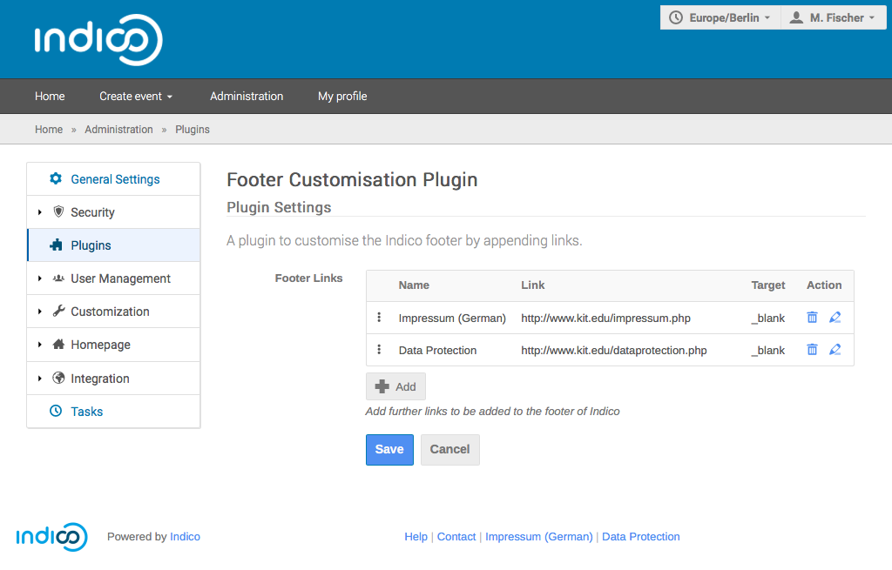

Configuration
=============

Once installed, the plugin can be configured from the ``Administration`` panel.
From the main page, select ``Administration`` -> ``Plugins`` -> ``Footer Customisation``.

Adding and Ordering Links
-------------------------

Configuration gives you access to an *ordered* list of links.
To add new links, use the ``+ Add`` button below the list.
The footer is populated with the links in the same order as in the list.
You can drag and drop entries to change their ordering.

Configuring Links
-----------------

Each link consists of three settings:

**Name**
   The link name as shown in the footer.

**Link**
   The address as pointed to by the link.

**Target**
   Where to open the link: ``_self`` for the current window/tab or ``_blank`` for a new window/tab.

You can configure each link separately by hitting the pencil button next to it.
Note that changes to a link must stored individually by hitting the disk button.
Only afterwards can changes be saved with the ``Save`` button.
